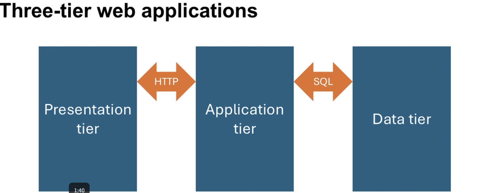
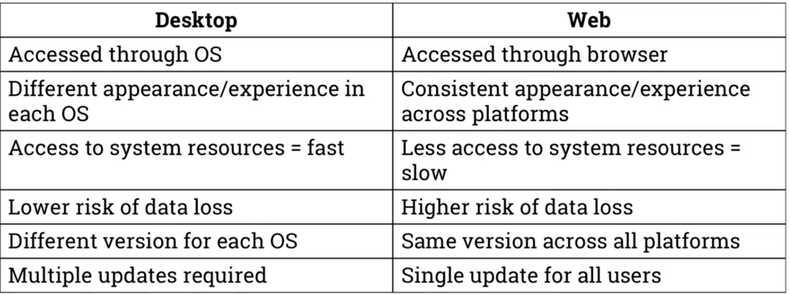
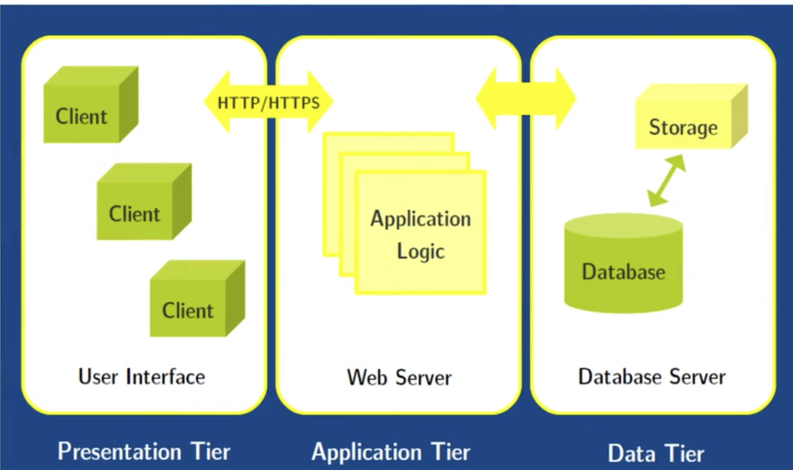
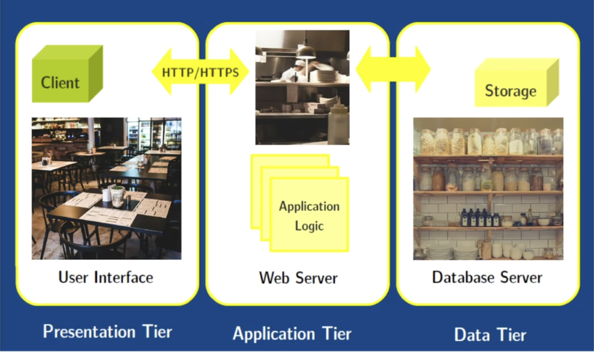

# Three tier web applications

- Understand the concepts of the RDB
- Implement RDB models
- Query data from RDB models
- Understand concepts of web architectures
- Build DB-driven, dynamic web applications
- Understand how computer networks work

## Static vs Dynamic web applications

- What is web application:  
    - > "a client-server software application in whic user interface runs in a browser"
    - > "computer program which allows a user to submit and retrieve data to/from a database over the internet using their preferred browser"
    - > "an application in which all or some parts of the software are downloaded from the web each time it runs. It may be browser based, client based, or native mobile based."

### Static web applications (eg yahoo.com/weather)
- Static internet resources
- Little to no interaction with the user
- No modern web apps really are really proper static

### Dynamic web applications (eg amazon.com)
- More user interactions
- Users can input, change and manipulate data

### Desktop vs web applications

## The life and timed of web request

### Calling a web application
1. URL is typed into browser
2. Browser cache is checked, if cached, skip to "Step 8" 
3. If not cached, DNS(Domain Name Server) lookup performed to find IP of the server
4. Browser initiates TCP(Transmission Control Protocol) connection with the server
5. Browser sends HTTP request to the server
6. Server handles incoming request
7. Browser receives HTTP response
8. Browser displays HTML content

## Three tier web application architecure
 - > "Three tier architectures were proposed in alternative to two-tier architectures. Three tier architectures offer higher degree of scalability than two tier configurations, thanks to better network utilization and to the virtually unlimited replication and load distribution capabilities of the middle tier."

## Restaurant analogy

