# Database design, part 1
## Developing dynamic web application
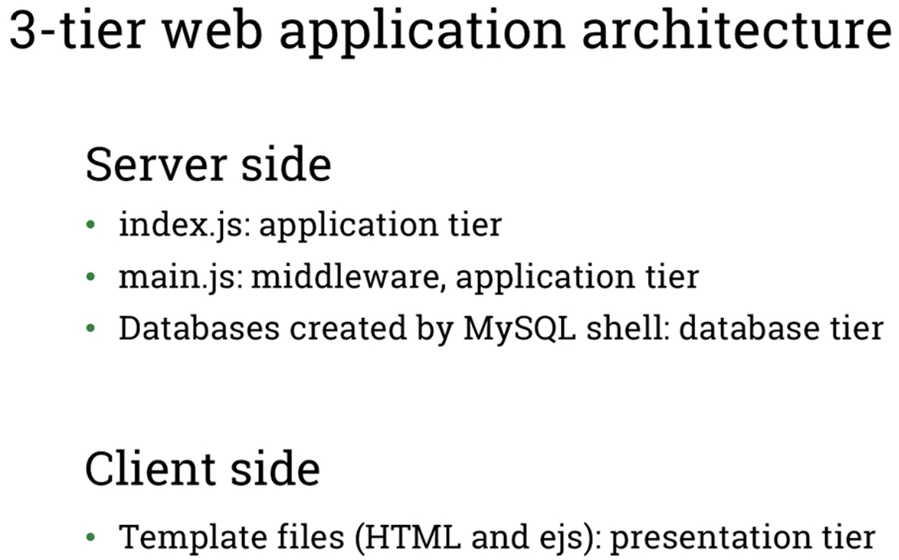
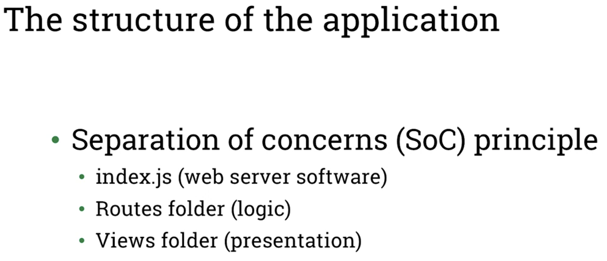
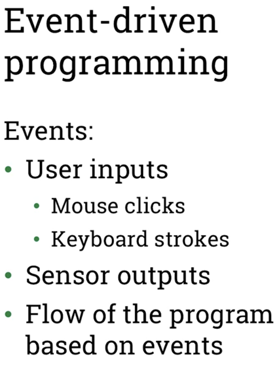
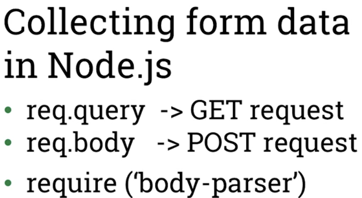

## Entity relationship diagrams and junction tables
- Designing a relational database
- 1. Identify  entities or tables
    - What is the purpose of the database?
        - Start from requirement list
        - One table for each entity
    - Identify properties (columns or fields) of each table
    - Decide on data types for each field
- 2. Decide on Primary keys
- 3. Decide on relationships between tables and foreign keys
- 4. Identify relationship cardinalities
- 5. Refine database design
- 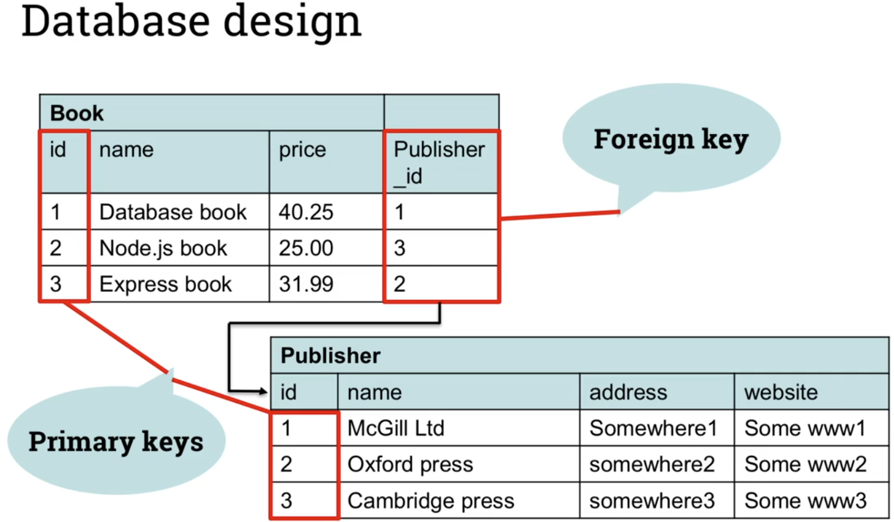

### Entity relationship diagrams
- Graphical representation, displaying entities in database and the relations between them
    - 
    - 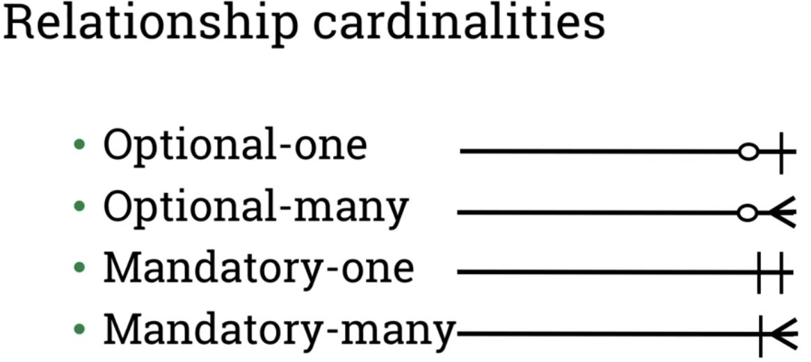
    - 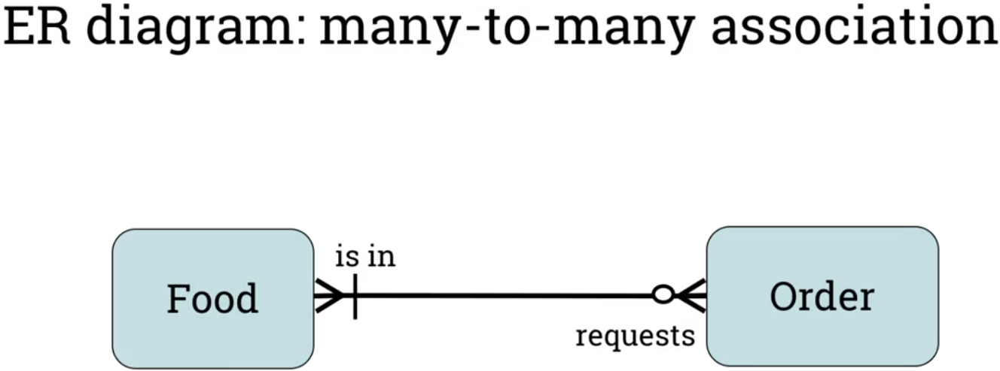
    - 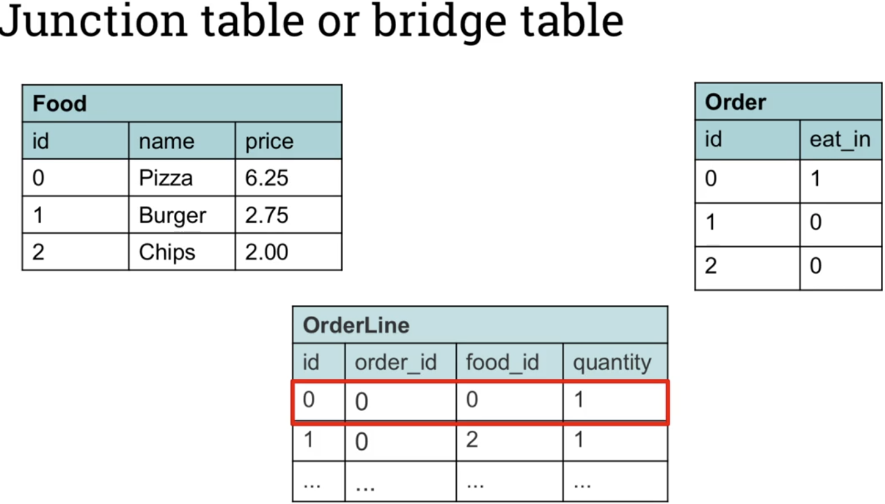

## Aproach of creating ERD (Entity Relationship Diagram)
- 1. Identify objects/entitie and fields/atributes in the requirements, that will make up the tables in our database.   
    - To identify object and fields, you can highlight all the nouns in requirements, these will usually indicate objects and fields we need to model:   
        - 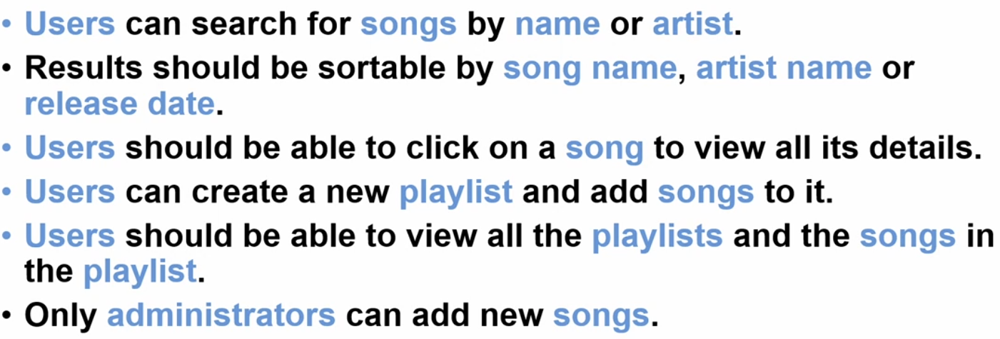
    - Create unique list of these nouns:
        - 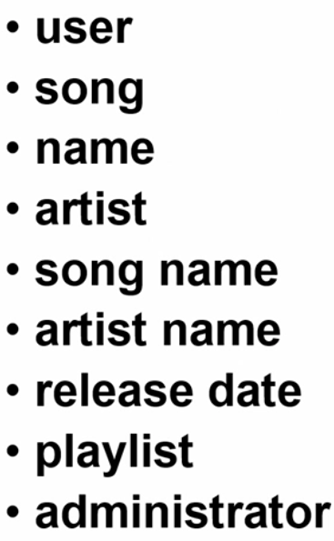
- 2. Take the unique list of nouns and organize into related terms: 
    - Like so:
        - 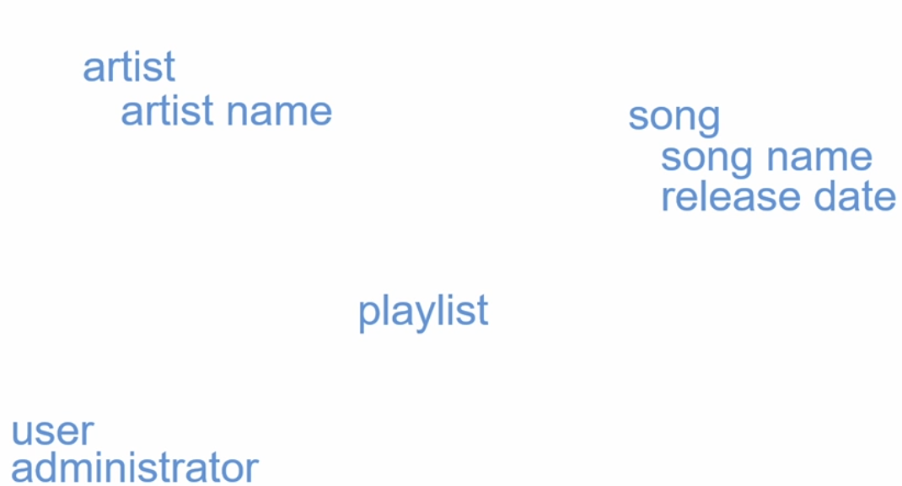
    - Add relations between them:
        - 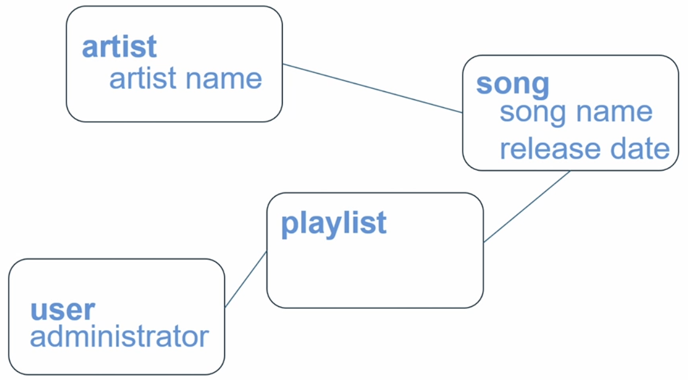
    - After some tidying up, we get start of the data model:
        - 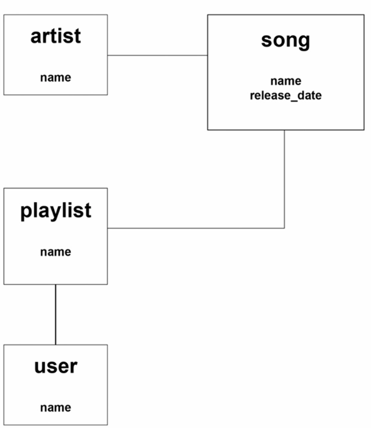
- 3. Refine the model:
    - Each object needs primary key for identification, and relation to other objects:
        - 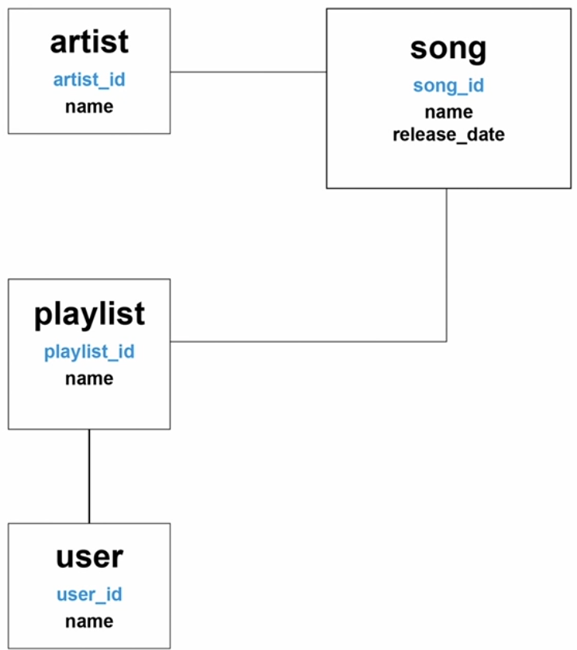
    - Then start looking at cardinality of relationships:
        - In this case we'll use 'one-to-many' for artist to song relationship (one artist per song, but many songs per artist), we also need to add artist_id to song object, to link it to artist object: 
            - 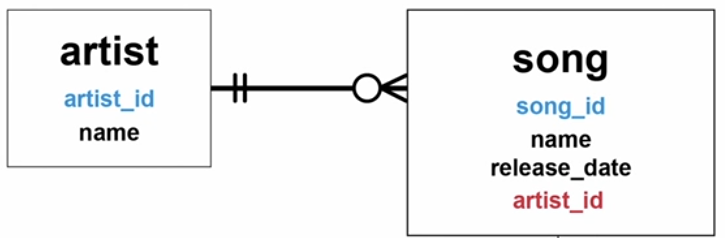
        - Next, relationship between song and playlist. Playlist can have many songs, and song can be on many playlists, so we use 'many-to-many' for this relationship. But for this we need to introduce junction table, like such:
            - 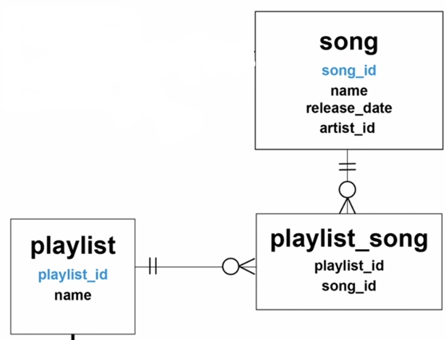
        - Finally, relationship between playlist and user. User can have many playlists, but in this case we'll use it as personal playlist, so playlist can have only one user, therefore 'one-to-many', and we add user_id to playlist:
            - 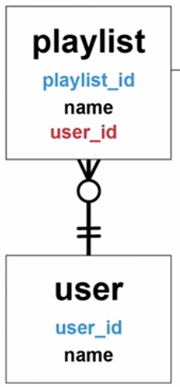
- And here is the final model we can use to create tables in our database:
    - 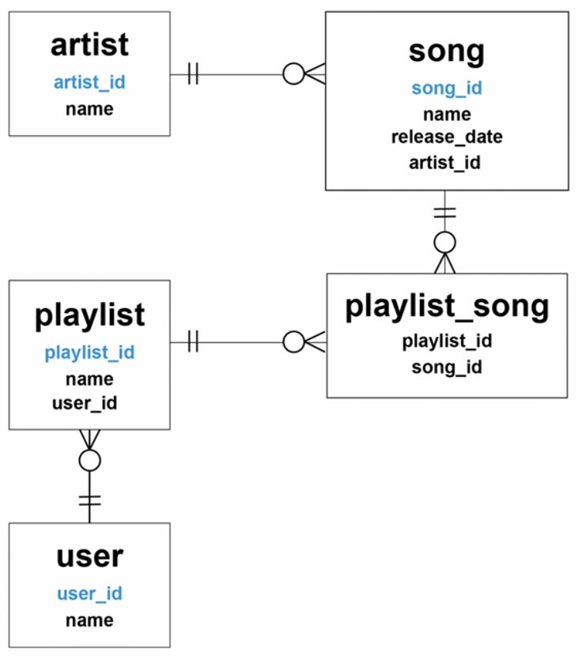