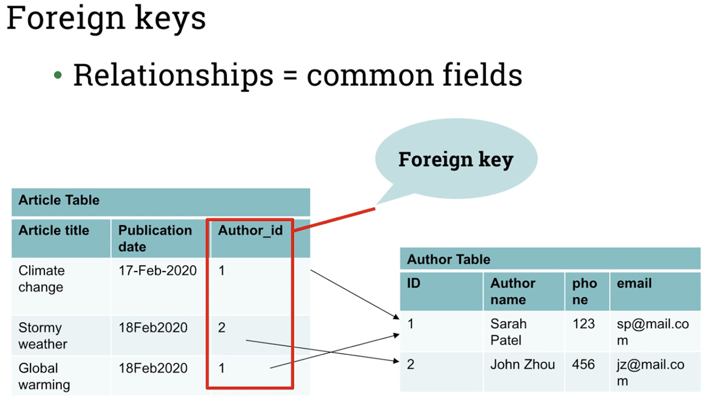
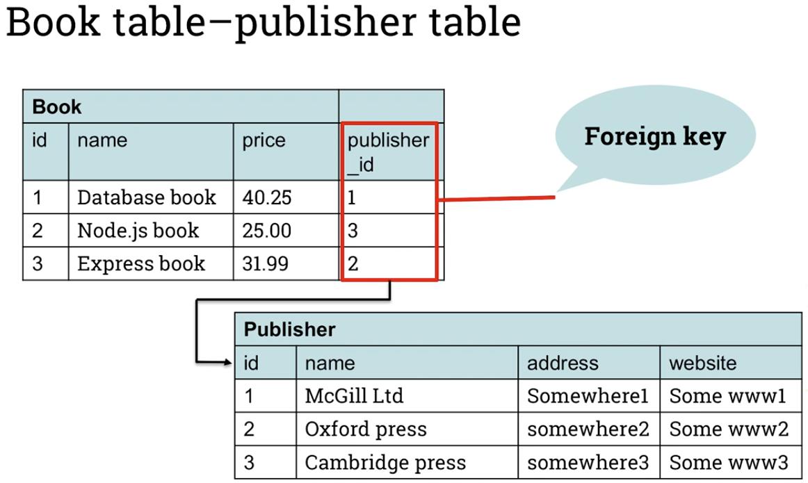
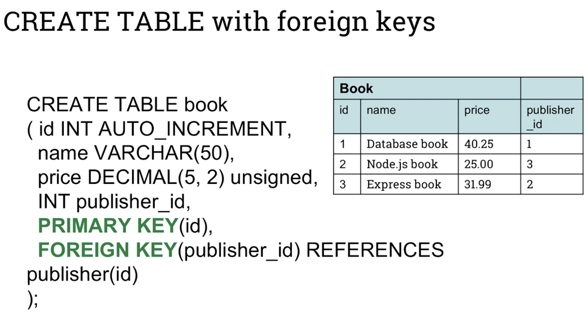

# Database design, part 2
## Foreign Keys (FK) and SQL JOIN
- Foreign key in a table is Primary Key in another table, which is used to model a relation betwee the two tables
    - 
    - 
- Foreign key constraint:
    - Ensures referencal integrity
    - Limits the content of the foreign key to the values of the referenced primary key

### CREATE TABLE with Foreign Keys
- 

### SELECT from multiple tables with JOIN
- General format of SQL JOIN is as follows:
    - ```
        SELECT field_name1, field_name2 FROM table1 JOIN table2 ON join_condition 
        WHERE select_condition
      ```
- Example to retrieve the name, price and publisher names of all the books priced $30 or more from across 2 tables:
    - 

### Lab 20 screenshot
- 