# JOIN and SELECT
- 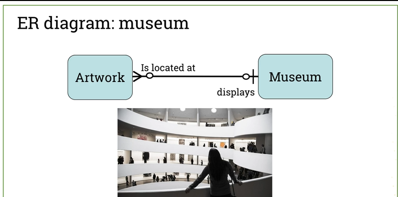
- 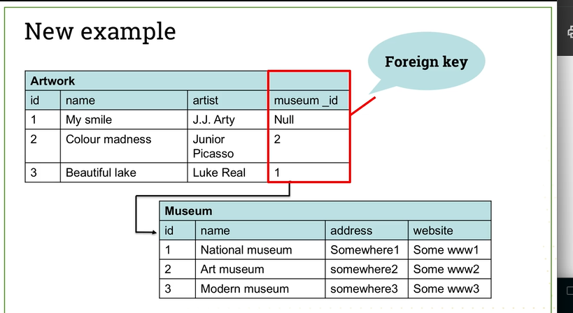
- 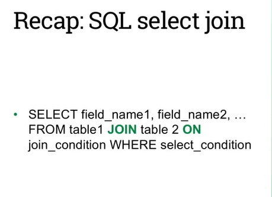
- 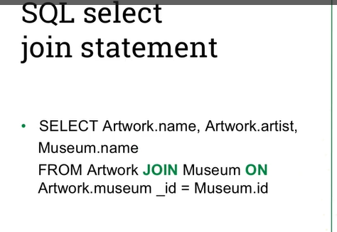
- 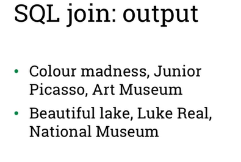
- 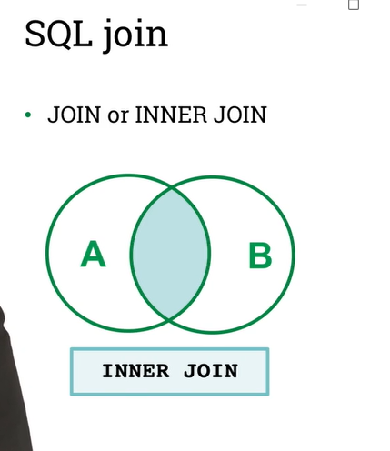
## Left and right joins
- 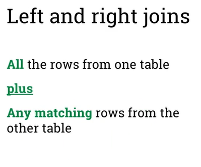
### Left join
- 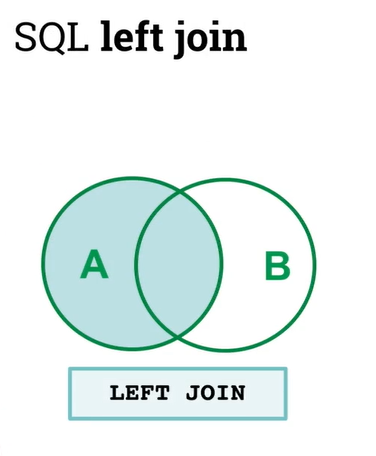
- 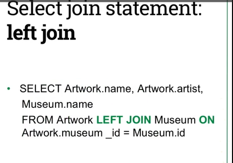
- 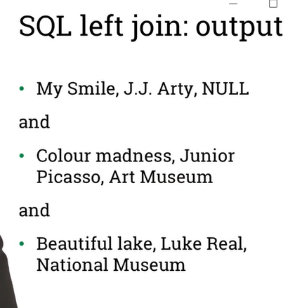
- 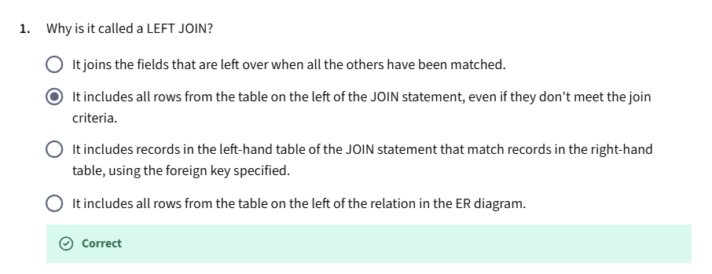
### Right join
- 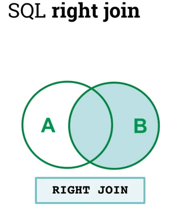
- 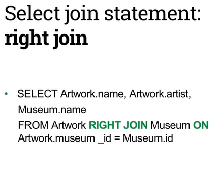
- 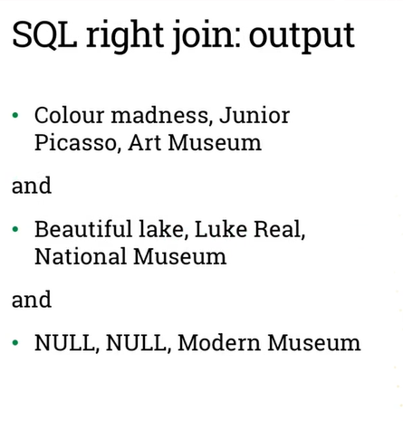

## LEFT JOIN and RIGHT JOIN lab
- Using myart database(week 16 lab)

### See a list of all the artworks and the museum that they are in. 
- You can achieve this by using a JOIN operation:
    - SELECT Artwork.name, Artwork.artist, Museum.name
    FROM Artwork
    JOIN Museum
    ON Artwork.museum_id = Museum.id;
    - 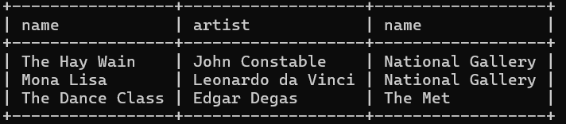
### Performing a LEFT JOIN operation:
- SELECT Artwork.name, Artwork.artist, Museum.name
FROM Artwork
LEFT JOIN Museum
ON Artwork.museum_id = Museum.id;
- 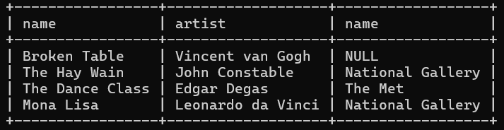

### Performing a RIGHT JOIN operation:
- SELECT Artwork.name, Artwork.artist, Museum.name
FROM Artwork
RIGHT JOIN Museum
ON Artwork.museum_id = Museum.id;
- 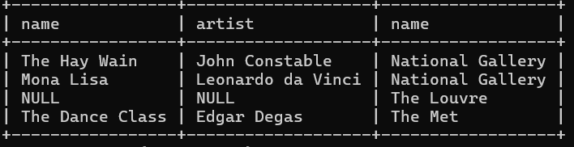

## After Lab video and explanation 
- 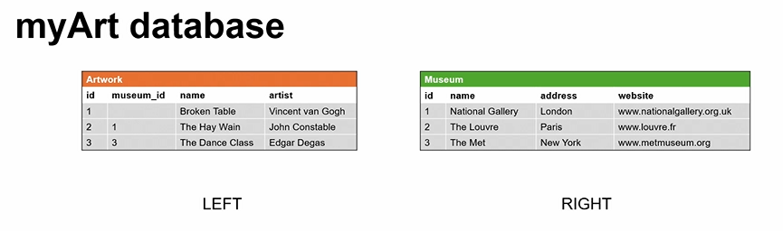
- 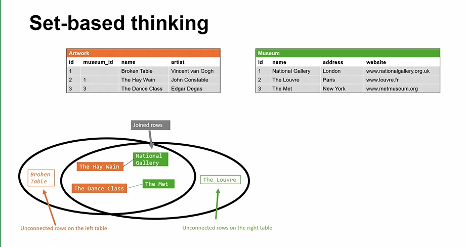

### Inner join (just JOIN)
- 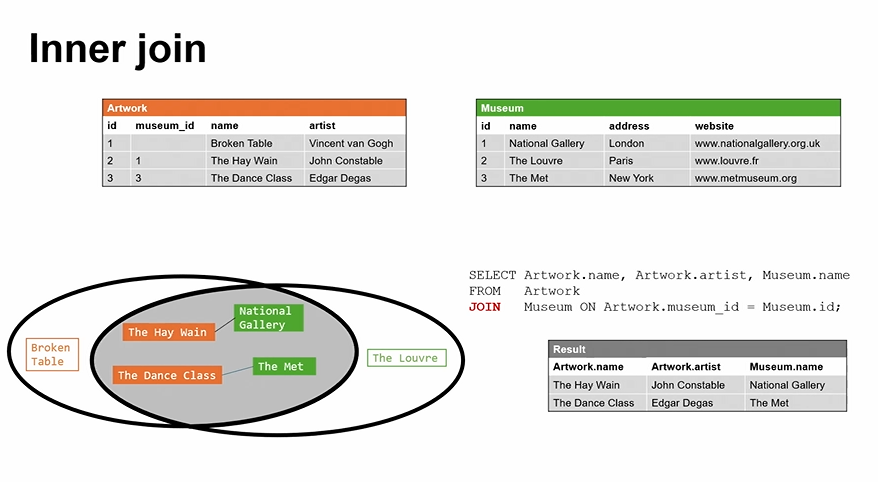

### Left join
- 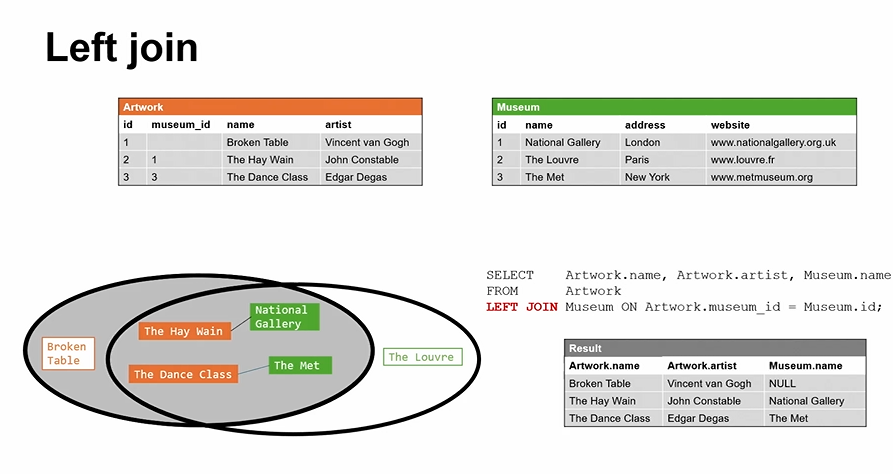

### Right join
- 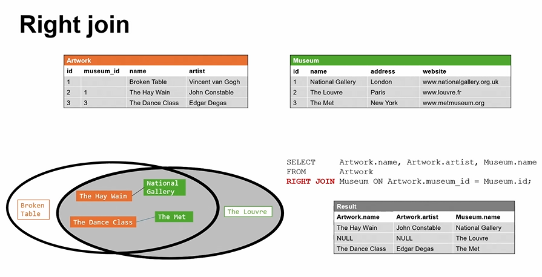

## Nested select LAB
- Using myotherbookshop database
1. Find all the books that are more expensive than ‘Web Architecture’:
    - SELECT name, price FROM Book
WHERE price > (SELECT price FROM Book WHERE name = 'Web
Architecture'); 

- Using myrestaurantmenu, find all dishes that are more expensive than Beer
    -  SELECT name, price FROM dishes WHERE price > (SELECT price FROM dishes WHERE name='Beer');

- Using myotherbookshop, find all books that are cheaper than the cheapest book on computing:
    - SELECT name, price, category FROM book WHERE price<(SELECT min(price) FROM books WHERE category='Computing');
## After lab video and explanation
- 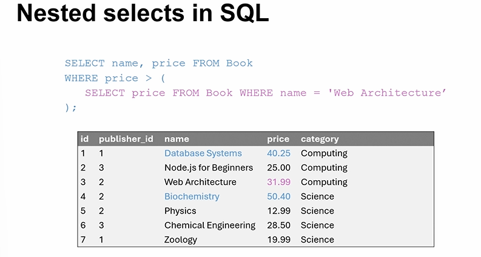
- 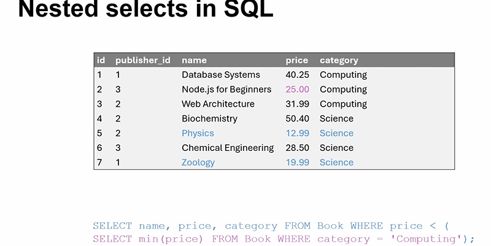