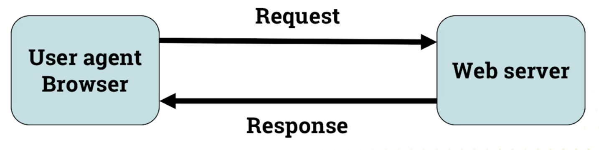
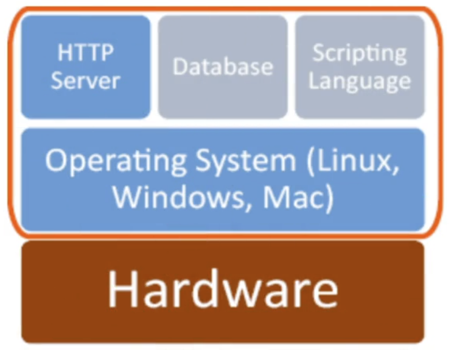
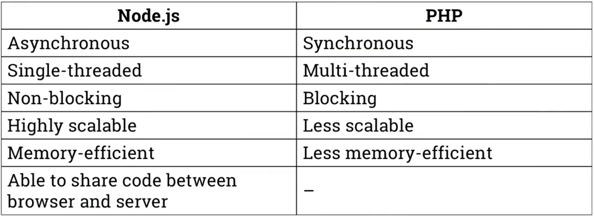

# Node.js and Express
- Node.js is javascript runtime environent that executes js outside the server
- Express is Node.js frameworrk for web development
## Web Servers
- >'... a program that uses HTTP to serve the files that form Web pages to users, in response to their requests, which are forwarded by their computers HTTP clients'
- > 'A server software, or hardware dedicated to running said software, that can satisfy WWW client requests. A web server processes incoming network requests over HTTP and several other related protocols'

## HTTP
- > '...a client-server application protocol, which defines the rules by which a client program, called a browser or user agent, and a server program, called a Web server, may interact in order to exchange requests and responses.'

## Web server architecture
- Hardware:
    - Anything from Rasberry Pi or computer to large stacks of servers
    - On premises or cloud
- Software:
    - Operating system
    - HTTP server
    - Databases
    - Scripting language
- Operating system:
    - Resource allocation
    - Communication between hardware and software
    - Web server can be Linux/Unix/Mac/Windows based
- HTTP server:
    - Compiles the results from databases and scripting language to be sent to the user
    - Controls what options are available to the end user (config files)
    - Shares web pages and scripts on a network

## Introduction to Node.js and Express\

### Node.js
- Open source cross-platform server environment that uses JS on the server-side.
- JS runtime environment (executes JS outside the browser)
- > 'As an asynchronous, event driven JS runtime environment, Node.js is designed to build scalable network applications.'
- Avoid Node.js  with CPU-intensive apps

- We will be using Node.js to:
    - Generate dynamic web applications
    - Access DB's
    - CRUD
    - Collect form data
    - Access templating engines
    - and more