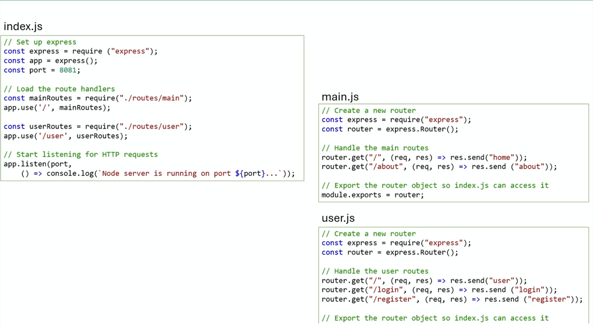
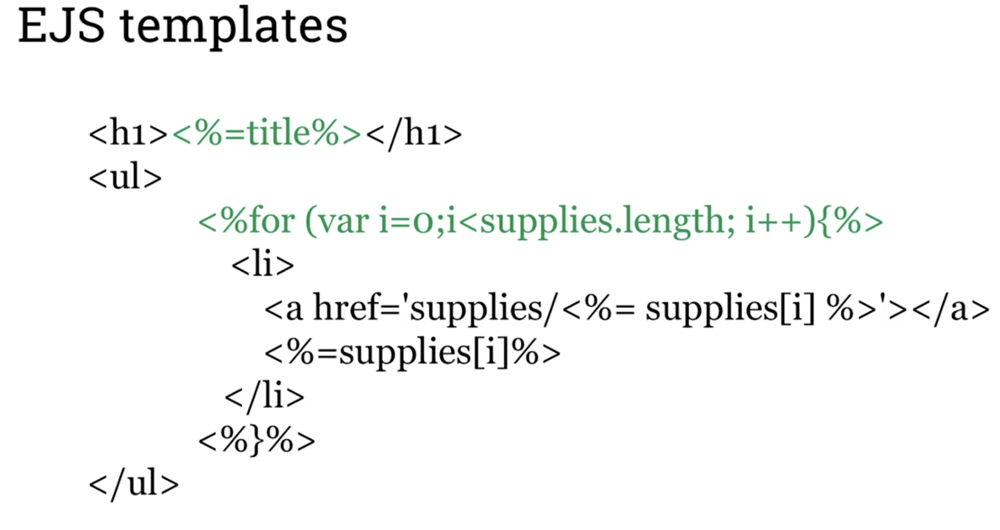

# Generating pages from data using templates
- Labs 6 and 7
- See html express folder for routing and html (ejs, Embedded JavaScript) file rendering, lab 5
- There may be multiple JS Route Handler files:
    - Note that route handlers in main.js are loaded under the **'/'** route, while in user.js they are loaded under **'/user'** route
        

## Templating and template engines
- Two main tasks of a templating engine:
    - Insert variables into the final output of the template
    - Run some programming logic at run-time before sending the final HTML to the browser for display
    - Some popular templating engines:
        - EJS
            - Simple template language for generating HTML with plain JavaScript
            - HTML + EJS tags(<%=%> and <%%>)
            - Embedding JS Expressions
            - .ejs file extension
            - <%=1+1%> will add 2 to the rendered ejs
            - <% var counter = 10 %> evaluates expression but does not add return value to document
            - 
            - 
        - PUG
            - Formerly known as Jade
            - Whitespace and indentation sensitive syntax
            - High performance and feature rich
            - Clean
        - Mustache
