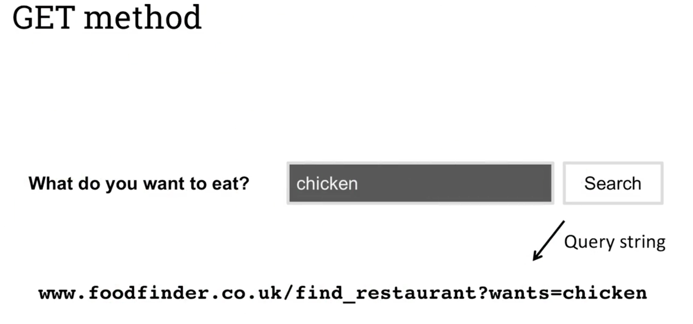
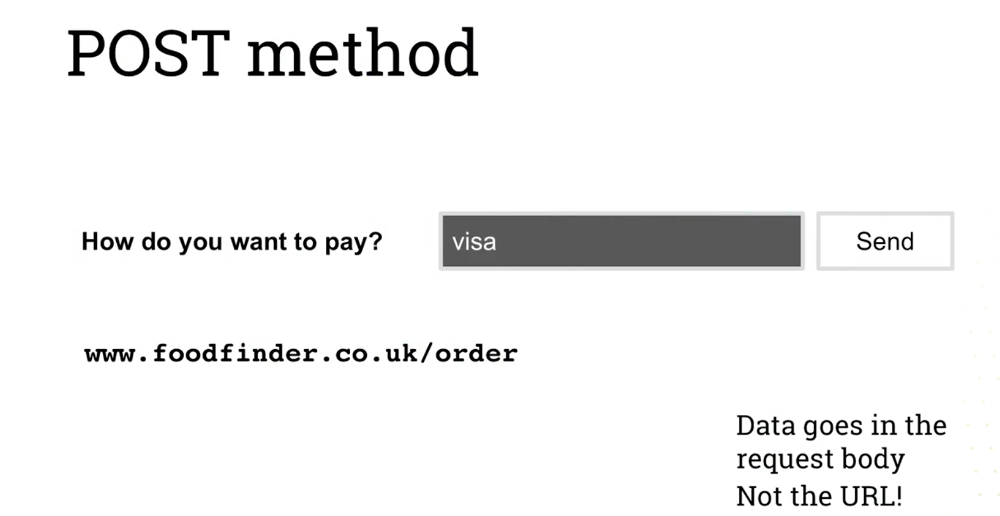

# GET and POST methods, Collecting form data
- Lab 9, (main.js and search.ejs)
- Lab 10 (register.ejs, main.js)
## GET vs POST methods
    - GET: request data from a resource
        - used to retrive data from server
        - not suitable when dealing with sensitive data, as data is sent in the URL of a get request
    - POST: send data to create or update resource
        - often used to send data from and HTML form
        - Data is stored in body of a POST request, no in the URL
- Cafe analogy:
    1. Customer tells owner that he'd like a sandwich
    2. Owner asks What do You want in it?
    3. C: Chicken
        - 

    4. O: How are You paying
    5. C: By card
        - 
## Forms in dynamic web applications
- Collects user input
- Contains input fields in HTML format
- Data sent to server as HTTP request
