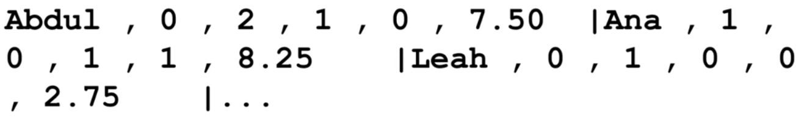
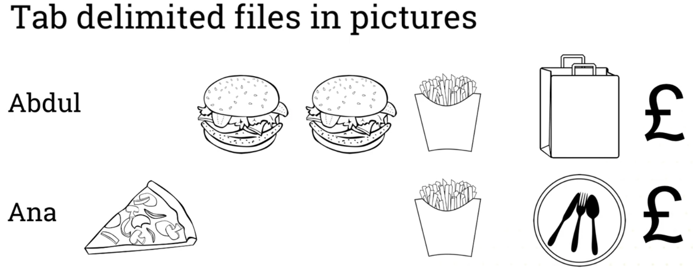
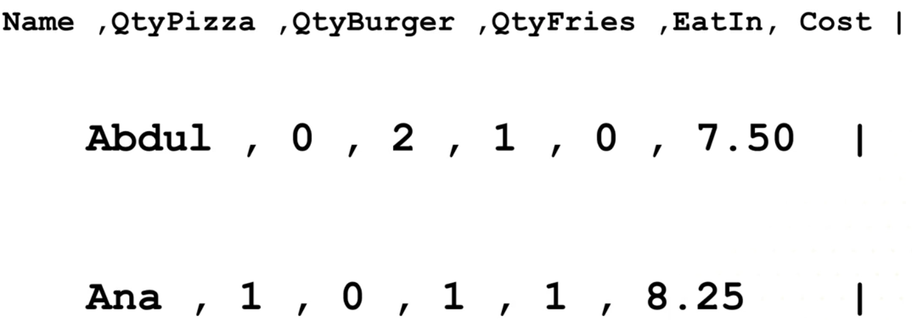
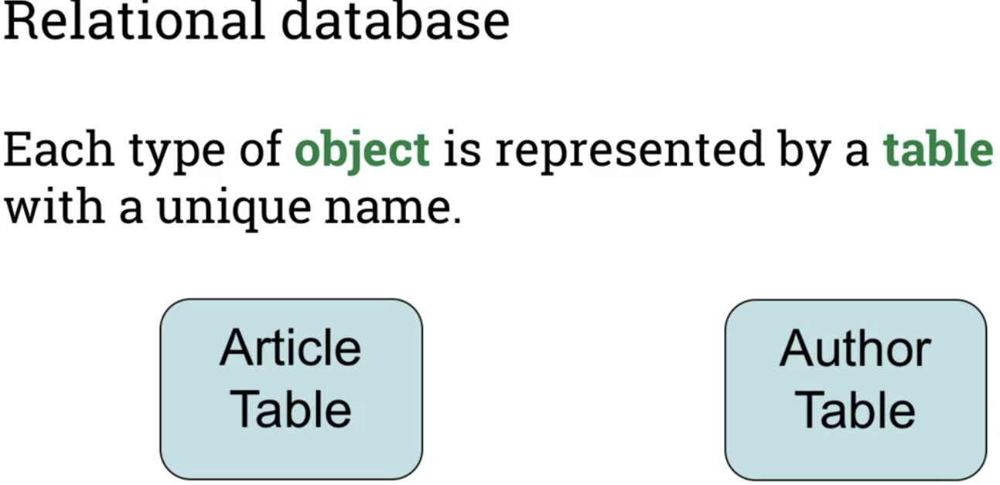
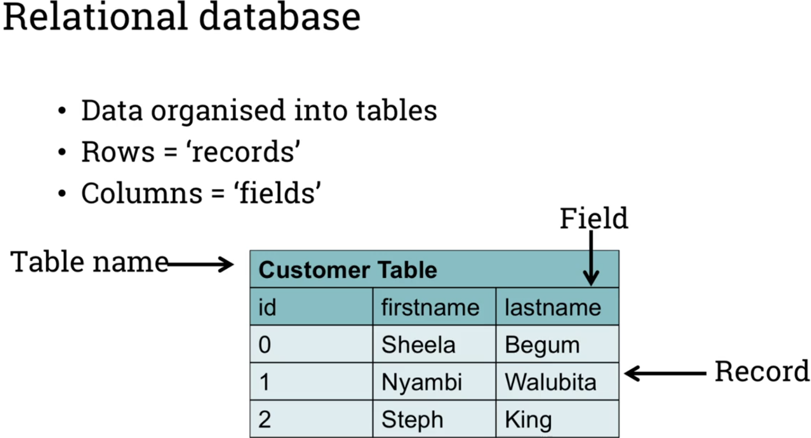
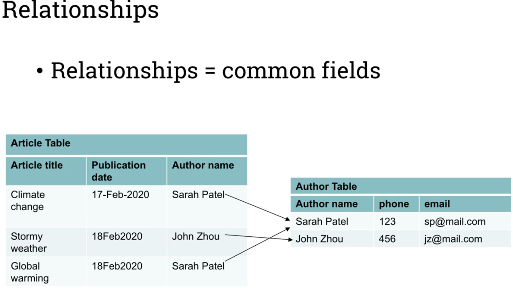

# Representing data in databases- Relational databases, part 1.
## Introduction to databases
### Newspaper archiving database example
- Before DBs were developed, data was mainly stored in lists
- Database is a collection of data that are:
    - Highly valuable
    - Relatively large
    - Accessed by multiple users and applications, often at the same time
- DBMS is Database + Software to manage it
- How to store data?
    - 
- Purpose of database:
    1. Store data
    2. Access and query(read) the data
    3. Create, modify and delete data
    4. Provide organizational structure for data
- Purpose of DBMS:
    - The primary goal of DBMS is to provide a way to store and retrieve information that is both convenient and efficient.

## Lists of data
- Lists were precursor to modern Databases, data was stored in linear files
    - These files were problematic to modify:
        - Insertion problems with data redundancy
        - Deletion problems with information loss
        - Update problems with more than one field being updated
    - Tab delimited files(lists):
        - 
        - 
        - 

## Introduction to relational Databases
- It was difficult to retrieve sets of data from lists quickly
- The relational model was developed to make the process simpler and quicker.
- Relational database:
    - > 'Represents data as collection tables in which all data relationships are represented by common values in related tables.'
        - 
        - 
        - 
- DBMS:
    - > 'A software system that is used to create, maintain and provide controlled access to user databases
    - SQL:
        - DB processing language
        - Designed to query and access data managed by RDBMS
    - MySQL:
        - Free and open-source RDBMS based on SQL